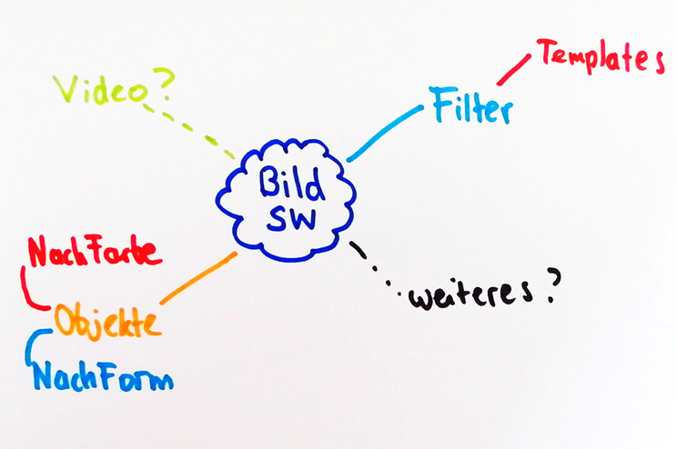

# Lösungsweg

Created: May 19, 2020 7:32 PM
Tags: Ansatz, Idee, Lösung, Planung, Übersicht

# Übersicht

Hier ist eine Systemübersicht der Komponente und Umgebung, die ich verwende/benötige.

Systemübersicht aller Komponente im Einsatz

[Equipment](res/Lösungsweg-Equipment.csv)

Ich habe für das Projekt mich für 2 Wege eingeplant. Der erste Weg war das ich alles von Grund auf selbst mit der Programmiersprache ***Typescript*** verwirkliche***.***
Der zweite war ein Backup-Plan falls das mit dem ersten Weg nicht funktionieren sollte.

---

# Organisation

Mithilfe des IPERKA-Systems habe ich meine Praxisarbeit aufgeteilt und organisiert.

## Informieren

Wie vorhin erwähnt habe ich mich für 2 potenzielle Wege informiert, um die Frage zu klären:

> ***Welche Programmiersprache soll ich benutzen?***

### Typescript

Diese Sprache basiert auf stark definierten Bausteinen für die Programmierung. Sie ist sehr robust und sehr beliebt bei Programmierern.
Ich habe mich für Programminterne-Module schlau gemacht und einige gefunden, die meinem Projekt hilfreich sein könnten.

Module die ich verwendet habe waren:

- camera

[camera](https://www.npmjs.com/package/camera)

Dieses Kamera Modul wird zum interagieren mit der Kamera API Schnittstelle verwendet.

- ts-node

[ts-node](https://www.npmjs.com/package/ts-node)

Zum Ausführen des Typescripts in Node.js wird dieses Modul benötigt, Grund: Das Programm wird automatisch kompiliert und ausgeführt.

- nodemon

[nodemon](https://www.npmjs.com/package/nodemon)

Dieses Modul wird zum automatisierten Neustart des Programms verwendet (Ist aber kein muss)

### Python

Diese Sprache existiert schon seit 30 Jahren und ist zurzeit auf Version 3.5+. Sie wird sehr oft von Programmierern verwendet und ist äußerst beliebt, da sie viele Bibliotheken mit sich trägt. Python erleichtert Automatisierungsprozesse und ist eine sehr leichte Programmiersprache. Ich habe mich um diese Sprache entschieden, damit ich meine Python-Skills auffrischen kann und kleineres lerne.

Bibliotheken die ich verwendet habe:

- OpenCV für Python3

[OpenCV](https://opencv.org/)

Die Hauptwebseite von OpenCV.

[OpenCV: Image Processing in OpenCV](https://docs.opencv.org/3.4/d2/d96/tutorial_py_table_of_contents_imgproc.html)

Die Reference der Bibliothek wo ich die meisten Codebeispiele übernommen habe.

---

## Planung

Da ich nicht mit der Planung Schwierigkeiten habe, nutze ich mehr Zeit für die Planung, um meine Prozedur zu erleichtern und einen roten Faden bei der Programmierung zu finden.

### Mindmap

Damit ich die Übersicht nicht verliere, habe ich mir als erstes ein Mindmap gemacht:

Hier sind meine **ersten Ideen** in einer Mindmap zu sehen.

### Zeitplanung

Meine Zeitplanung besteht aus 2 Teilen: 

1. Die Arbeitstermine der Arbeitsschritte und Meilensteine.
2. Terminvergabe für die Aktivität: *Dokumentation schreiben.*

Anhand des Mindmaps habe ich eine Checkliste vorbereitet, welche - egal auf welchen Weg ich mich entscheide - das selbe Ziel erfüllt.

> Die erste Checkliste - V1

- Equipment
    - [ ]  Equipment einrichten
    - [ ]  Betriebssystem installieren
    - [ ]  Voraussetzungen erfüllen (Bibliotheken oder Module)
    - [ ]  Equipment testen
    - [ ]  Lerndokumentation ***Version 1*** vorbereiten
- Programmierung
    - [ ]  Programmierumgebung einrichten
    - [ ]  Erste Programmstruktur planen
    - [ ]  Programmstruktur implementieren
    - [ ]  Testing implemetieren
- Dokumentation
    - [ ]  Praxisdokumentation vorbereiten
    - [ ]  Code-Snippets erstellen
    - [ ]  Textkonzept notieren.
    - [ ]  Text verfassen
- Präsentation
    - [ ]  Powerpoint vorbereiten
    - [ ]  Visio vorbereiten
    - [ ]  FAQ einbauen

---

> Arbeitspakete und Meilensteine

- Arbeitspakete

    Die Arbeitspakete sind die einzelnen Schritte die bearbeitet werden müssen. Diese haben bei mir festgelegte Termine zugewiesen bekommen an die ich mich halten sollte.

    [Die Termine](res/Die-Termine-1.csv)

- Meilensteine

    Die Meilensteine müssen fest definiert sein, damit ich mich so gut wie Möglich auf ein Zeitraffer einhalten kann. Die Funktion dieser Meilensteine ist ein kleiner Checkpoint welcher für sich eine Prozedur abschließt und die nächste Hürde freischaltet.
    Meine Meilensteine wären:

    [Die Termine](res/Die-Termine-2.csv)